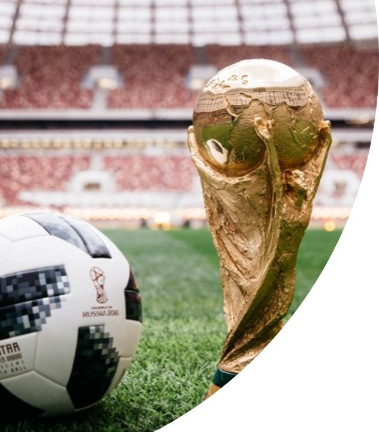
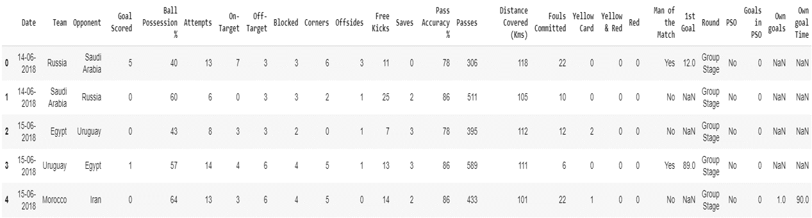

# Machine-Learning-and-EDA-of-FIFA-WorldCup-2018

## INTRODUCTION
The dataset consist of the information about all the matches played between each teams in the FIFA World Cup 2018. Various variables are present in the dataset includes team, opponent team, ball possession, passes, free kicks, goal scored, corners, goals, 1st goal time etc.

It comprises of 3456 observation.

## DATA
| Column Name | Description |
| --- | --- |
| `Date` | Date(DD-MM_YYYY)(on which date match played) |
| `Team` | String (Name of team) |
| `Opponent` | String (Name of Opponent team) |
| `Goal Scored` | INT(Number of Goals scored by Team) |
| `Ball Possession %`| Percentage of keeping the ball in the match |
| `Attempts` | Number of Attempts taken by the team to score a goal |
| `On-Target` | Number of shoots which is On-Target |
| `Off_Target` | Number of shoots which is Off-Target |
| `Blocked` | Number of attempts blocked for opponents |
| `Corners` | Number of corners taken by a team |
| `Off Sides` | Number of Off Sides taken by a team |
| `Free Kicks` | Number of Free Kicks taken by a team |
| `Saves` | Number of saves done by a team |
| `Pass Accuracy %` | Percentage of correct passes   |
| `Passes` | Number of passess given by team members |
| `Distance Covered (Kms)` | Number of Kms all team members run in a match |
| `Fouls Committed` | Number of fouls committed by a team in a match |
| `Yellow Card` | Number of Yellow cards received to a team member |
| `Yellow and Red card` | Number of Yellow and Red cards received to a team member |
| `Red Card` | Number of RED cards received to a team member |
| `Man of the Match` | Man of the matched received by a team member or not   |
| `1st Goal` | After how many minutes, 1st goal was scored by the team |
| `Round` | Stage of the Match ie., Group Stage, Semi Final etc |
| `PSO` | Match in which Penalty shoot out was done |
| `Goals in PSO` | Number of goals scored by the team in Penalty Shoot Out |
| `Own Goals` | Own goals committed by a team member |
| `Own Goal Time` | At what minute, team scored an own goal |

## PROJECT ANALYSIS
| Description | Analysis |
| --- | --- |
| fifa_data.head |  |

### Analysis Result
- Performance of team in the World Cup.
- Number of matches each team played, number of matches each team won in the World Cup.
- Number of Goals Scored, Attempts taken by team to score a goal, Number of shoots which are On-Taget and Off-Target.
- Number of free kicks, passes, saves done by a team.
- Number of matches where Penalty Shoot Out was taken
- Created graph for each analysis which is easy to undersatnd.
- Created new columns: - "Winning Team" and "Won Team" based on "Man Of Match Column"
- After EDA, I applied Logistic Regression to predict whether the team will Win.
- Model Evaluation by Confusion Matrix and craeted Decision Tree of Data Set.
